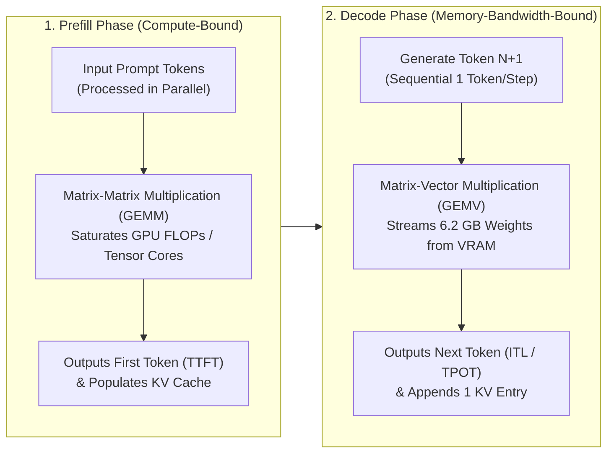

# AI Infrastructure Hands-On Lab: GKE, NVIDIA L4 & vLLM (Lab 1)

A hands-on engineering repository for learning and benchmarking foundational and production **AI Infrastructure** concepts on **Google Kubernetes Engine (GKE)** using **NVIDIA L4 GPUs (24 GB VRAM)** and **vLLM**.

This guide is designed so **anyone** can clone the repository, spin up a reproducible GPU-accelerated Kubernetes environment on Google Cloud from scratch, run real-world LLM serving benchmarks, interact with the model via its OpenAI/OpenAPI-compatible endpoints, and tear down all resources when done.

---

## Repository Structure (Phase 0 & Lab 1)

| File | Description |
| :--- | :--- |
| [`vllm-deployment.yaml`](./vllm-deployment.yaml) | Production GKE Deployment & Service manifest for `Qwen/Qwen2.5-3B-Instruct` on an NVIDIA L4 GPU with PagedAttention and Automatic Prefix Caching enabled. |
| [`01_paged_attention_simulation.py`](./01_paged_attention_simulation.py) | Mathematical simulation demonstrating why traditional contiguous KV cache allocation wastes ~80% of VRAM and how vLLM's **PagedAttention** (`--block-size=16`) achieves >95% utilization. |
| [`02_multi_user_load_test.py`](./02_multi_user_load_test.py) | Asynchronous (`asyncio`/`aiohttp`) multi-user load generator demonstrating **Continuous Batching** throughput scaling (`1 -> 5 -> 10 -> 20` concurrent users). |
| [`benchmark_prefill_decode.py`](./benchmark_prefill_decode.py) | Streaming benchmark dissecting **Prefill (TTFT - Time To First Token)** vs. **Decode (ITL - Inter-Token Latency)** and measuring **Automatic Prefix Caching** speedups. |

---

## Part 1: Core AI Infrastructure Concepts

### 1. Where Does GPU Memory (VRAM) Go?
When serving an LLM like `Qwen/Qwen2.5-3B-Instruct` on a **24 GB NVIDIA L4 GPU** with `--gpu-memory-utilization=0.85` (**20.4 GB total budget**), VRAM is divided into three distinct regions:

$$\text{Total Allocated VRAM (20.4 GB)} = \underbrace{\text{Model Weights (6.2 GB)}}_{\text{Static } (3\text{B} \times 2\text{ bytes BF16})} + \underbrace{\text{CUDA Workspace (1.5 GB)}}_{\text{PyTorch Activations}} + \underbrace{\text{PagedAttention KV Cache (12.7 GB)}}_{\text{Dynamic User Conversation States}}$$

### 2. Prefill vs. Decode: Two Different Hardware Bottlenecks
LLM inference consists of two distinct phases per request:



* **Prefill Phase (Governs TTFT — Time To First Token)**:
  * Processes all input prompt tokens in parallel using a single Matrix-Matrix Multiplication (**GEMM**).
  * **Hardware Bottleneck**: **GPU Compute (FLOPs)**. Longer prompts require proportionally more compute time.
* **Decode Phase (Governs ITL / TPOT — Inter-Token Latency / Time Per Output Token)**:
  * Generates output tokens sequentially one at a time via Matrix-Vector Multiplication (**GEMV**).
  * To generate just **1 token** for 1 user, the GPU must stream **all 6.2 GB of model weights** from VRAM into compute registers.
  * **Hardware Bottleneck**: **GPU Memory Bandwidth (GB/s)**.
* **Why Continuous Batching Works**: By batching $N$ concurrent users together during Decode, the GPU loads the 6.2 GB of weights **once** per step and computes 1 token for all $N$ users simultaneously—multiplying system throughput (`tok/s`) by 3x–6x!

---

## Part 2: End-to-End Infrastructure Setup (Google Cloud & GKE)

### Prerequisites
* A Google Cloud Project with billing enabled and quota for at least **1x NVIDIA L4 GPU** (`NVIDIA_L4_GPUS`) in your target region (e.g., `us-central1`).
* `gcloud`, `kubectl`, and `python3` (`pip install aiohttp requests`) installed (all pre-installed in **Google Cloud Shell**).

### Step 1: Clone the Repository
Clone this repository and navigate into the lab directory:

```bash
git clone https://github.com/<YOUR_GITHUB_USERNAME>/ai-infra-lab.git
cd ai-infra-lab
```

### Step 2: Set Environment Variables & Enable APIs
Set your project variables once so all subsequent commands work seamlessly:

```bash
export PROJECT_ID="your-gcp-project-id"   # <-- Replace with your GCP Project ID
export REGION="us-central1"
export ZONE="us-central1-a"
export CLUSTER_NAME="ai-infra-lab-cluster"

gcloud config set project $PROJECT_ID

# Enable Compute Engine and Kubernetes Engine APIs
gcloud services enable compute.googleapis.com container.googleapis.com
```

### Step 3: Create a Base GKE Cluster
Create a standard regional/zonal GKE cluster with a lightweight CPU default node pool for system components:

```bash
gcloud container clusters create $CLUSTER_NAME \
  --zone=$ZONE \
  --project=$PROJECT_ID \
  --machine-type=e2-standard-4 \
  --num-nodes=2

# Fetch cluster credentials for kubectl
gcloud container clusters get-credentials $CLUSTER_NAME \
  --zone=$ZONE \
  --project=$PROJECT_ID
```

### Step 4: Add a Spot NVIDIA L4 GPU Node Pool (with Autoscaling 0 → 2 Nodes)
We attach a dedicated GPU node pool using `g2-standard-4` (4 vCPUs, 16 GiB RAM, **1x NVIDIA L4 24 GiB GPU**).
* Using `--spot` saves ~60–70% on GPU compute costs.
* Using `--enable-autoscaling --min-nodes=0` ensures the GPU node pool automatically scales down to **0 nodes ($0/hr)** whenever your vLLM pod is deleted.
* Including `gpu-driver-version=default` tells GKE to automatically install the official NVIDIA GPU drivers on boot.

```bash
gcloud container node-pools create gpu-l4-pool \
  --cluster=$CLUSTER_NAME \
  --zone=$ZONE \
  --project=$PROJECT_ID \
  --machine-type=g2-standard-4 \
  --accelerator=type=nvidia-l4,count=1,gpu-driver-version=default \
  --spot \
  --num-nodes=1 \
  --enable-autoscaling \
  --min-nodes=0 \
  --max-nodes=2
```

### Step 5: Verify GPU Allocatable Status in Kubernetes
Wait ~2–3 minutes after node creation for the background NVIDIA driver installation to complete, then check that `1` GPU is allocatable:

```bash
kubectl get nodes -o custom-columns=NAME:.metadata.name,GPU:.status.allocatable."nvidia\.com/gpu"
```

*Expected Output:*
```text
NAME                                                  GPU
gke-ai-infra-lab-cluster-default-pool-...             <none>
gke-ai-infra-lab-cluster-gpu-l4-pool-...              1
```

### Step 6: Deploy vLLM (`Qwen/Qwen2.5-3B-Instruct`)
Deploy the vLLM server and wait for the pod to download the model weights and initialize the GPU KV cache (~2 minutes):

```bash
kubectl apply -f vllm-deployment.yaml
kubectl get pods -l app=vllm-qwen -w
```

### Step 7: Port-Forward & Run Lab 1 Benchmarks
In **Terminal Tab 1**, forward port `8000`:
```bash
kubectl port-forward svc/vllm-qwen-service 8000:8000
```

In **Terminal Tab 2**, install dependencies and run the three Lab 1 scripts:
```bash
pip install aiohttp requests

# 1. PagedAttention vs. Contiguous KV Cache Math Simulation
python3 01_paged_attention_simulation.py

# 2. Prefill (TTFT) vs. Decode (ITL) & Prefix Cache Benchmark
python3 benchmark_prefill_decode.py

# 3. Multi-User Continuous Batching Load Test (1 -> 5 -> 10 -> 20 concurrent users)
python3 02_multi_user_load_test.py
```

---

## Part 3: Deep Dive into vLLM Configuration Arguments

Below is the breakdown of every CLI flag configured in [`vllm-deployment.yaml`](./vllm-deployment.yaml) and how each controls GPU memory and batch scheduling:

* **`--model=Qwen/Qwen2.5-3B-Instruct`**: Downloads and loads the 3-Billion parameter instruction-tuned Qwen 2.5 model in 16-bit (`BF16`), consuming **~6.2 GB of VRAM** for static weights.
* **`--port=8000`**: Binds the FastAPI HTTP server to port `8000`, exposing OpenAI-compatible inference routes alongside a Prometheus `/metrics` endpoint.
* **`--gpu-memory-utilization=0.85`**: Reserves **85% of the L4's 24 GB VRAM (20.4 GB)** for vLLM. After loading weights (~6.2 GB) and CUDA workspace (~1.5 GB), the remaining **~12.7 GB is pre-allocated into 16-token PagedAttention KV cache blocks**. The remaining 15% (~3.6 GB) acts as safety headroom against CUDA Out-Of-Memory (OOM) crashes.
* **`--max-model-len=4096`**: Caps the maximum context length (prompt + completion) per request at 4,096 tokens (down from Qwen's native 32,768 limit) so no single request can monopolize the KV cache pool.
* **`--max-num-seqs=64`**: Caps active **Continuous Batching** concurrency at 64 simultaneous sequences per forward pass to protect per-token latency (ITL). Any requests beyond #64 wait safely in the queue (`vllm:num_requests_waiting`).
* **`--enable-prefix-caching`**: Turns on **Automatic Prefix Caching (APC)**. vLLM hashes every 16-token KV cache block; requests sharing a common system prompt reuse existing KV blocks in VRAM and skip Prefill computation entirely.

---

## Part 4: OpenAI / OpenAPI Compatibility & Interactive Usage (`/v1/chat/completions`)

### Why OpenAPI & OpenAI Compatibility Matters in Production
The `vllm.entrypoints.openai.api_server` module is built on **FastAPI** and implements the full **OpenAPI 3.0 specification** alongside the official **OpenAI REST API schema**. This gives you two major advantages in production AI Infrastructure:

1. **Zero-Code-Change Drop-In Replacement**: Any application, microservice, or framework (such as the official `openai` Python/TypeScript SDKs, LangChain, LlamaIndex, or Open WebUI) can switch from OpenAI's cloud API to your self-hosted GKE vLLM cluster simply by changing the base URL (`http://localhost:8000/v1`).
2. **Self-Documenting OpenAPI Schema**: You can inspect the interactive Swagger UI or download the full OpenAPI JSON schema directly from your running server:
   * **Interactive Swagger Docs**: `http://localhost:8000/docs`
   * **OpenAPI Specification**: `http://localhost:8000/openapi.json`
   * **Loaded Models List**: `http://localhost:8000/v1/models`

### 1. Sending Chat Prompts via `curl` (`/v1/chat/completions`)
With `kubectl port-forward svc/vllm-qwen-service 8000:8000` active, send an interactive multi-turn or creative prompt to `/v1/chat/completions`:

```bash
curl http://localhost:8000/v1/chat/completions \
  -H "Content-Type: application/json" \
  -d '{
    "model": "Qwen/Qwen2.5-3B-Instruct",
    "messages": [
      {
        "role": "system",
        "content": "You are a senior AI Infrastructure Architect explaining concepts clearly."
      },
      {
        "role": "user",
        "content": "Explain why PagedAttention prevents GPU memory fragmentation in 3 bullet points."
      }
    ],
    "temperature": 0.7,
    "max_tokens": 200
  }' | jq -r '.choices[0].message.content'
```

### 2. Sending Raw Text Prompts via `curl` (`/v1/completions`)
For non-chat text completion tasks, query `/v1/completions`:

```bash
curl http://localhost:8000/v1/completions \
  -H "Content-Type: application/json" \
  -d '{
    "model": "Qwen/Qwen2.5-3B-Instruct",
    "prompt": "The three most important metrics for LLM serving are:",
    "max_tokens": 100,
    "temperature": 0.3
  }' | jq -r '.choices[0].text'
```

### 3. Using the Official OpenAI Python SDK with Your GKE vLLM Server
Because vLLM is 100% OpenAI API-compatible, you can use the standard `openai` Python library (`pip install openai`):

```python
from openai import OpenAI

# Point the official OpenAI client to your local/GKE vLLM endpoint
client = OpenAI(
    base_url="http://localhost:8000/v1",
    api_key="not-needed-for-local-vllm",
)

response = client.chat.completions.create(
    model="Qwen/Qwen2.5-3B-Instruct",
    messages=[
        {"role": "user", "content": "Write a haiku about GPUs and Kubernetes."}
    ],
    temperature=0.7,
)

print(response.choices[0].message.content)
```

---

## Part 5: Cost Control & Cleanup
To avoid incurring ongoing GPU or cluster charges when you pause your experiments:

```bash
# Option A: Delete only the vLLM deployment (GPU node pool will autoscale down to 0 in ~10 mins)
kubectl delete -f vllm-deployment.yaml

# Option B: Delete the entire GKE cluster and all node pools
gcloud container clusters delete $CLUSTER_NAME --zone=$ZONE --project=$PROJECT_ID --quiet
```
