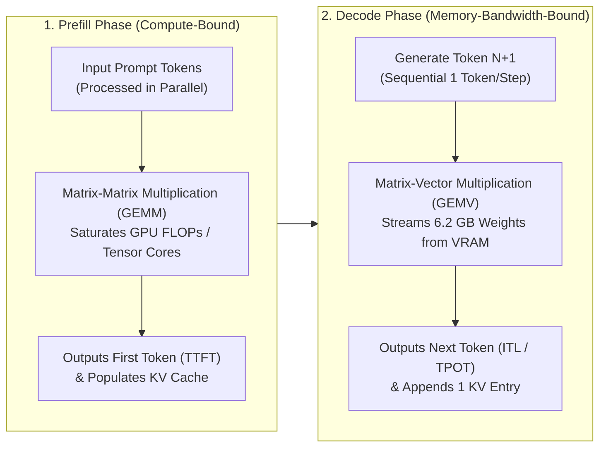

# AI Infrastructure Hands-On Lab: GKE, NVIDIA L4 & vLLM (Lab 1)

A hands-on engineering repository for learning and benchmarking foundational and production **AI Infrastructure** concepts on **Google Kubernetes Engine (GKE)** using **NVIDIA L4 GPUs (24 GB VRAM)** and **vLLM**.

This guide is designed so **anyone** can clone the repository, spin up a reproducible GPU-accelerated Kubernetes environment on Google Cloud from scratch, run real-world LLM serving benchmarks, and tear down all resources when done.

---

## Repository Structure (Phase 0 & Lab 1)

| File | Description |
| :--- | :--- |
| [`vllm-deployment.yaml`](./vllm-deployment.yaml) | Production GKE Deployment & Service manifest for `Qwen/Qwen2.5-3B-Instruct` on an NVIDIA L4 GPU with PagedAttention and Automatic Prefix Caching enabled. |
| [`01_paged_attention_simulation.py`](./01_paged_attention_simulation.py) | Mathematical simulation demonstrating why traditional contiguous KV cache allocation wastes ~80% of VRAM and how vLLM's **PagedAttention** (`--block-size=16`) achieves >95% utilization. |
| [`02_multi_user_load_test.py`](./02_multi_user_load_test.py) | Asynchronous (`asyncio`/`aiohttp`) multi-user load generator demonstrating **Continuous Batching** throughput scaling (`1 -> 5 -> 10 -> 20` concurrent users). |
| [`benchmark_prefill_decode.py`](./benchmark_prefill_decode.py) | Streaming benchmark dissecting **Prefill (TTFT - Time To First Token)** vs. **Decode (ITL - Inter-Token Latency)** and measuring **Automatic Prefix Caching** speedups. |

---

## Part 1: Core AI Infrastructure Concepts

### 1. Where Does GPU Memory (VRAM) Go?
When serving an LLM like `Qwen/Qwen2.5-3B-Instruct` on a **24 GB NVIDIA L4 GPU** with `--gpu-memory-utilization=0.85` (**20.4 GB total budget**), VRAM is divided into three distinct regions:

$$\text{Total Allocated VRAM (20.4 GB)} = \underbrace{\text{Model Weights (6.2 GB)}}_{\text{Static } (3\text{B} \times 2\text{ bytes BF16})} + \underbrace{\text{CUDA Workspace (1.5 GB)}}_{\text{PyTorch Activations}} + \underbrace{\text{PagedAttention KV Cache (12.7 GB)}}_{\text{Dynamic User Conversation States}}$$

### 2. Prefill vs. Decode: Two Different Hardware Bottlenecks
LLM inference consists of two distinct phases per request:



* **Prefill Phase (Governs TTFT — Time To First Token)**:
  * Processes all input prompt tokens in parallel using a single Matrix-Matrix Multiplication (**GEMM**).
  * **Hardware Bottleneck**: **GPU Compute (FLOPs)**. Longer prompts require proportionally more compute time.
* **Decode Phase (Governs ITL / TPOT — Inter-Token Latency / Time Per Output Token)**:
  * Generates output tokens sequentially one at a time via Matrix-Vector Multiplication (**GEMV**).
  * To generate just **1 token** for 1 user, the GPU must stream **all 6.2 GB of model weights** from VRAM into compute registers.
  * **Hardware Bottleneck**: **GPU Memory Bandwidth (GB/s)**.
* **Why Continuous Batching Works**: By batching $N$ concurrent users together during Decode, the GPU loads the 6.2 GB of weights **once** per step and computes 1 token for all $N$ users simultaneously—multiplying system throughput (`tok/s`) by 3x–6x!

---

## Part 2: End-to-End Infrastructure Setup (Google Cloud & GKE)

### Prerequisites
* A Google Cloud Project with billing enabled and quota for at least **1x NVIDIA L4 GPU** (`NVIDIA_L4_GPUS`) in your target region (e.g., `us-central1`).
* `gcloud`, `kubectl`, and `python3` (`pip install aiohttp requests`) installed (all pre-installed in **Google Cloud Shell**).

### Step 1: Set Environment Variables & Enable APIs
Set your project variables once so all subsequent commands work seamlessly:

```bash
export PROJECT_ID="your-gcp-project-id"   # <-- Replace with your GCP Project ID
export REGION="us-central1"
export ZONE="us-central1-a"
export CLUSTER_NAME="ai-infra-lab-cluster"

gcloud config set project $PROJECT_ID

# Enable Compute Engine and Kubernetes Engine APIs
gcloud services enable compute.googleapis.com container.googleapis.com
```

### Step 2: Create a Base GKE Cluster
Create a standard regional/zonal GKE cluster with a lightweight CPU default node pool for system components:

```bash
gcloud container clusters create $CLUSTER_NAME \
  --zone=$ZONE \
  --project=$PROJECT_ID \
  --machine-type=e2-standard-4 \
  --num-nodes=2

# Fetch cluster credentials for kubectl
gcloud container clusters get-credentials $CLUSTER_NAME \
  --zone=$ZONE \
  --project=$PROJECT_ID
```

### Step 3: Add a Spot NVIDIA L4 GPU Node Pool (with Autoscaling 0 → 2 Nodes)
We attach a dedicated GPU node pool using `g2-standard-4` (4 vCPUs, 16 GiB RAM, **1x NVIDIA L4 24 GiB GPU**).
* Using `--spot` saves ~60–70% on GPU compute costs.
* Using `--enable-autoscaling --min-nodes=0` ensures the GPU node pool automatically scales down to **0 nodes ($0/hr)** whenever your vLLM pod is deleted.
* Including `gpu-driver-version=default` tells GKE to automatically install the official NVIDIA GPU drivers on boot.

```bash
gcloud container node-pools create gpu-l4-pool \
  --cluster=$CLUSTER_NAME \
  --zone=$ZONE \
  --project=$PROJECT_ID \
  --machine-type=g2-standard-4 \
  --accelerator=type=nvidia-l4,count=1,gpu-driver-version=default \
  --spot \
  --num-nodes=1 \
  --enable-autoscaling \
  --min-nodes=0 \
  --max-nodes=2
```

### Step 4: Verify GPU Allocatable Status in Kubernetes
Wait ~2–3 minutes after node creation for the background NVIDIA driver installation to complete, then check that `1` GPU is allocatable:

```bash
kubectl get nodes -o custom-columns=NAME:.metadata.name,GPU:.status.allocatable."nvidia\.com/gpu"
```

*Expected Output:*
```text
NAME                                                  GPU
gke-ai-infra-lab-cluster-default-pool-...             <none>
gke-ai-infra-lab-cluster-gpu-l4-pool-...              1
```

### Step 5: Deploy vLLM (`Qwen/Qwen2.5-3B-Instruct`)
Deploy the vLLM server and wait for the pod to download the model weights and initialize the GPU KV cache (~2 minutes):

```bash
kubectl apply -f vllm-deployment.yaml
kubectl get pods -l app=vllm-qwen -w
```

### Step 6: Port-Forward & Run Lab 1 Benchmarks
In **Terminal Tab 1**, forward port `8000`:
```bash
kubectl port-forward svc/vllm-qwen-service 8000:8000
```

In **Terminal Tab 2**, install dependencies and run the three Lab 1 scripts:
```bash
pip install aiohttp requests

# 1. PagedAttention vs. Contiguous KV Cache Math Simulation
python3 01_paged_attention_simulation.py

# 2. Prefill (TTFT) vs. Decode (ITL) & Prefix Cache Benchmark
python3 benchmark_prefill_decode.py

# 3. Multi-User Continuous Batching Load Test (1 -> 5 -> 10 -> 20 concurrent users)
python3 02_multi_user_load_test.py
```

---

## Part 3: Real-World Kubernetes & AI Infra Troubleshooting Q&A

Below are detailed explanations for real-world engineering issues encountered while setting up and running Lab 1.

### Q1: Why did `gcloud container node-pools create` print a warning note about NVIDIA GPU drivers, and do I need to manually apply the DaemonSet?
* **Answer**: On **GKE 1.30+**, GKE automatically installs the default NVIDIA GPU driver in the background. However, if you omit `gpu-driver-version=default` inside the `--accelerator` flag, the `gcloud` CLI prints a generic reminder note.
* **How to check**: Run `kubectl get pods -n kube-system | grep nvidia`. If you see `nvidia-driver-installer-...`, GKE is already installing the driver automatically! Only apply the manual DaemonSet (`kubectl apply -f https://raw.githubusercontent.com/GoogleCloudPlatform/container-engine-accelerators/master/nvidia-driver-installer/cos/daemonset-preloaded-latest.yaml`) if no installer pod appears after node creation.

---

### Q2: Why did `status.allocatable["nvidia.com/gpu"]` show `<none>` right after the node booted, and what does the value `1` represent?
* **Why it showed `<none>`**: After a GPU VM boots, it takes **2–3 minutes** for the `nvidia-driver-installer` pod to download kernel headers, compile/load the NVIDIA kernel modules, and register the device with `kubelet`.
* **What `1` represents**: It means Kubernetes has registered **1 physical NVIDIA L4 GPU (24 GB VRAM)** as an indivisible integer resource unit (`nvidia.com/gpu: "1"`).
  * Unlike CPU (`500m`) or RAM (`4Gi`), standard Kubernetes cannot split a GPU fractionally. When our vLLM pod requests `nvidia.com/gpu: "1"`, it receives **exclusive access to all 24 GB of VRAM**, preventing any other container from interfering with vLLM's PagedAttention KV cache pool.

---

### Q3: Why did the GPU node scale down to 0 (`1 node(s) were unschedulable`) and fail to scale back up when the pod requested `cpu: "4"` and `memory: "16Gi"` on `g2-standard-4`?
* **Why it scaled down**: Because `--enable-autoscaling --min-nodes=0` was set, GKE's Cluster Autoscaler cordoned (`SchedulingDisabled` / `unschedulable`) and terminated the idle GPU node after ~10 minutes to save GPU costs.
* **Why `cpu: "4"` and `memory: "16Gi"` blocked scale-up**:
  * A `g2-standard-4` VM has **4 vCPUs and 16 GiB RAM total (`Capacity`)**.
  * However, GKE reserves ~0.1 vCPU and ~2.5 GiB RAM for the OS, `kubelet`, and `kube-system` DaemonSets (including the NVIDIA driver pods). This leaves **~3.8 vCPUs and ~13.4 GiB RAM as actual `Allocatable` capacity**.
  * When the pod requested `memory: "16Gi"`, the Cluster Autoscaler simulated spinning up a `g2-standard-4`, saw that `16Gi > 13.4Gi`, and refused to scale up because the pod would never fit!
* **The Fix**: In [`vllm-deployment.yaml`](./vllm-deployment.yaml), setting `requests: {cpu: "2", memory: "10Gi"}` and `limits: {cpu: "2", memory: "12Gi"}` fits comfortably inside `g2-standard-4`'s allocatable budget while still giving the container 100% of the L4 GPU (`nvidia.com/gpu: "1"`).

---

### Q4: What does each vLLM CLI flag in `vllm-deployment.yaml` do?
* `--model=Qwen/Qwen2.5-3B-Instruct`: Downloads the 3B parameter BF16 model (~6.2 GB VRAM).
* `--port=8000`: Exposes the OpenAI-compatible HTTP server (`/v1/completions`, `/v1/chat/completions`) and Prometheus `/metrics` endpoint on port 8000.
* `--gpu-memory-utilization=0.85`: Reserves 85% of the L4's 24 GB VRAM (**20.4 GB**) for vLLM. After loading weights (~6.2 GB) and workspace (~1.5 GB), the remaining **~12.7 GB is pre-allocated into 16-token PagedAttention KV cache blocks**. The remaining 15% (~3.6 GB) acts as safety headroom against CUDA Out-Of-Memory (OOM) errors.
* `--max-model-len=4096`: Caps maximum context length per request at 4,096 tokens (down from Qwen's native 32k) so no single request can monopolize the KV cache.
* `--max-num-seqs=64`: Caps active Continuous Batching concurrency at 64 simultaneous sequences per forward pass to protect per-token latency (ITL).
* `--enable-prefix-caching`: Turns on **Automatic Prefix Caching (APC)**. vLLM hashes every 16-token KV cache block; requests sharing a common system prompt reuse existing KV blocks in VRAM and skip Prefill computation.

---

### Q5: Why did Cloud Shell Web Preview show `Couldn't connect to a server on port 8080` and then `{"detail": "Not Found"}`?
* **Port `8080` vs `8000`**: Google Cloud Shell's "Web Preview" defaults to port `8080`, whereas `kubectl port-forward svc/vllm-qwen-service 8000:8000` forwards port `8000`. Changing Web Preview to port `8000` (or forwarding `8080:8000`) resolves the connection error.
* **Why `/` returns `{"detail": "Not Found"}`**: This JSON response comes directly from FastAPI inside vLLM! Because vLLM is a headless API server (not an HTML website), the root URL `/` has no route. Appending `/v1/models`, `/health`, or `/metrics` displays the live server data.

---

### Q6: Why did `kubectl logs -l app=vllm-qwen | grep -E "KV cache|blocks|memory"` return no output?
* **Subtle `kubectl` behavior**: When you query logs using a **label selector (`-l app=vllm-qwen`)**, `kubectl` automatically defaults to **`--tail=10`** (printing only the last 10 lines of logs!).
* Because vLLM continuously logs periodic `/health` checks, the startup lines where vLLM printed the KV cache block counts scrolled past the last 10 lines.
* **The Fix**: Add **`--tail=-1`** to search the entire log history from container startup:
  ```bash
  kubectl logs -l app=vllm-qwen --tail=-1 | grep -iE "cache|block|memory|gpu"
  ```

---

### Q7: Can I use `Qwen/Qwen2.5-3B-Instruct` for daily tasks (creative writing, general purpose), and how should I size larger models for an NVIDIA L4 (24 GB VRAM)?
* **Using the 3B model**: Yes! It is very fast (~100+ tok/s) and works well for drafting, summarization, rewriting, and basic coding via `/v1/chat/completions`.
* **Upgrading model quality on 1x NVIDIA L4 (24 GB VRAM)**:
  * **Unquantized (`BF16`) Upgrade**: **`Qwen/Qwen2.5-7B-Instruct`** or **`meta-llama/Llama-3.1-8B-Instruct`** (~15.5 GB weights $\rightarrow$ ~5 GB remaining for KV cache). Great quality boost for 1–8 concurrent users.
  * **Quantized (`4-bit AWQ`) Production Upgrade**: **`Qwen/Qwen2.5-14B-Instruct-AWQ`** (~8.5 GB weights $\rightarrow$ ~11 GB remaining for KV cache). Fits a 14-Billion parameter model on a single L4 GPU with near GPT-4o-mini quality and high multi-user concurrency!

---

## Part 4: Cost Control & Cleanup
To avoid incurring ongoing GPU or cluster charges when you pause your experiments:

```bash
# Option A: Delete only the vLLM deployment (GPU node pool will autoscale down to 0 in ~10 mins)
kubectl delete -f vllm-deployment.yaml

# Option B: Delete the entire GKE cluster and all node pools
gcloud container clusters delete $CLUSTER_NAME --zone=$ZONE --project=$PROJECT_ID --quiet
```
